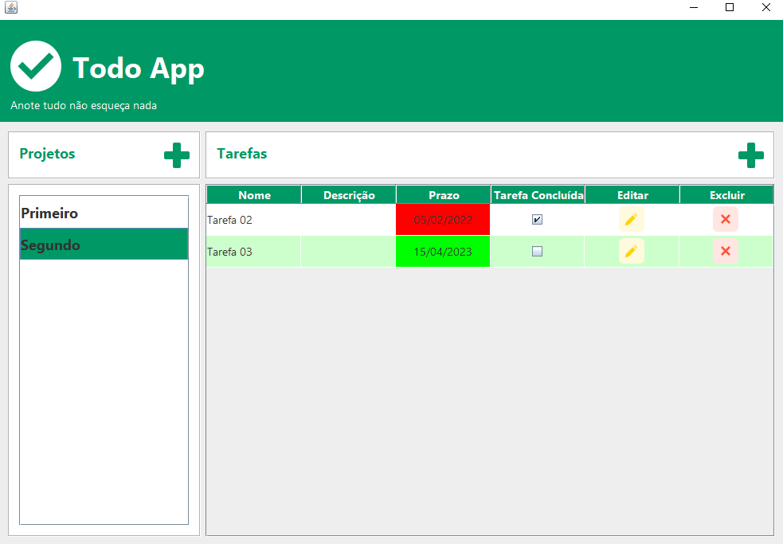

# TODO APP JAVA

Aplicação Desktop para gerenciamento de projetos e tarefas

## Descrição do projeto: 

O TodoApp tem como objetivo resolver a questão de organização de tarefas de um ou vários projetos.

## Funcionalidades do projeto

* `Funcionalidade 1` Criar projetos
* `Funcionalidade 2` Alterar projetos
* `Funcionalidade 3` Deletar projetos
* `Funcionalidade 4` Buscar projetos
* `Funcionalidade 5` Criar tarefas
* `Funcionalidade 6` Alterar tarefas
* `Funcionalidade 7` Deletar tarefas
* `Funcionalidade 8` Buscar tarefas
* `Funcionalidade 9` Criar usuários

## Demo:



## Instação:

1. Clonar o repositório:
```
$ git clone https://github.com/albertoafaj/todo-app-java.git
```
2. Instalar MySql

3. Casdastrar Bancos de dados no MySQL

``` todoappjava ```
  
4. Importar e executar arquivo ```database_creation_script.sql``` para criação de tabela e relacionamentos
   
5. Cadastre as variáveis de ambiente
```
DRIVER = "com.mysql.jdbc.Driver";
URL = "jdbc:mysql://localhost:3306/todoapp"; // USER = "seu usuario mysql";
PASS = "sua senha mysql";
```
6. Rodando a aplicação:
Iniciar MainScreen.java

## Tecnologias utilizadas

* JAVA
* MySQL